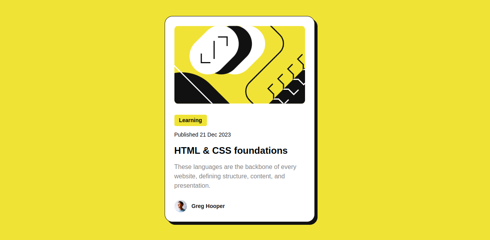

# Frontend Mentor - Blog preview card solution

This is a solution to the [Blog preview card challenge on Frontend Mentor](https://www.frontendmentor.io/challenges/blog-preview-card-ckPaj01IcS). Frontend Mentor challenges help you improve your coding skills by building realistic projects. 

## Table of contents

- [Frontend Mentor - Blog preview card solution](#frontend-mentor---blog-preview-card-solution)
  - [Table of contents](#table-of-contents)
  - [Overview](#overview)
    - [The challenge](#the-challenge)
    - [Screenshot](#screenshot)
    - [Links](#links)
  - [My process](#my-process)
    - [Built with](#built-with)
    - [What I learned](#what-i-learned)
  - [Author](#author)

## Overview

### The challenge

Users should be able to:

- See hover and focus states for all interactive elements on the page

### Screenshot

### Links

- [Solution URL](https://github.com/julianesilvac75/blog-preview-card)
- [Live Site URL](https://blog-preview-card-theta-bice.vercel.app/)

## My process

### Built with

- Semantic HTML5 markup
- CSS custom properties
- Flexbox
- Mobile-first workflow

### What I learned

This was my first time following a Figma design and trying to make it the most similar to the design possible. It was confusing at first, but once I started to understand how Figma works, it made the design building process much easier.

## Author

- Frontend Mentor - [@julianesilvac75](https://www.frontendmentor.io/profile/julianesilvac75)
- [Linkedin](https://www.linkedin.com/in/juliane-cardoso-silva/)
